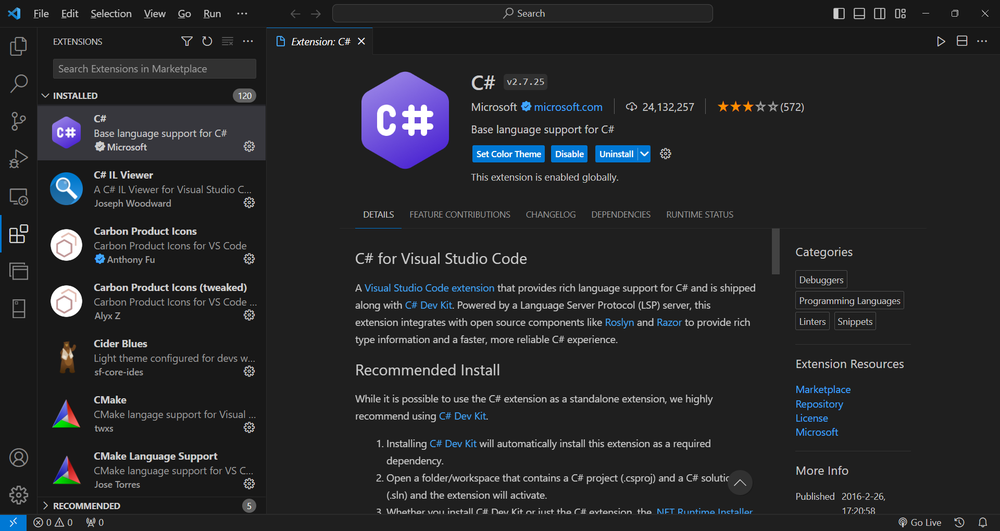

# Neophodne instalacije

## Windows instalacije

### Linkovi do potrebnih alata:

[Visual Studio Code](https://code.visualstudio.com/)

[Azure Data Studio](https://docs.microsoft.com/en-us/sql/azure-data-studio/download-azure-data-studio)

[LocalDB](https://docs.microsoft.com/en-us/sql/database-engine/configure-windows/sql-server-express-localdb)

[.NET 5 SDK](https://dotnet.microsoft.com/download/visual-studio-sdks)

Sve potrebne instalacije su dostupne na linkovima iznad. Visual Studio Code dolazi sa podrškom za `JavaScript` i `TypeScript` nakon instalacije. Da bi u njemu postojala podrška za `C#`, neophodno je instalirati `C# ekstenziju` i `OmniSharp`. Ekstenzije se instaliraju klikom na dugme `Extensions` sa leve strane:

Nakon što se ova ekstenzija instalira, prvi put prilikom pokretanja bilo koje C# datoteke, pojaviće se prozor sa progresom instalacije `OmniSharp-a`. Neophodno je dopustiti ovoj instalaciji da se izvrši do kraja, a kada se pojavi tekst `Finished.` `C#` ekstenziju je moguće koristiti sa svim pogodnostima koje pruža.

Od korišćenih tehnologija, pomenuću još `Windows Terminal`. On nije neophodan za razvoj Web API aplikacija, ali može da olakša pokretanje i kontrolu aplikacija zato što nudi rad sa tabovima.

[Windows Terminal](https://docs.microsoft.com/en-us/windows/terminal/install)

## Linux i Mac instalacije

Instalacija većine alata koje je moguće koristiti na Windows operativnom sistemu, moguća je i na većini Linux distribucija, kao i na nekim Mac verzijama operativnog sistema. 

Instalacija za Azure Data Studio se nalazi na istoj adresi, koja se nalazi u odeljku za Windows operativni sistem. Ostale instalacije možete pronaći na:

[Visual Studio Code](https://code.visualstudio.com/download)

[.NET 5 SDK](https://dotnet.microsoft.com/download/dotnet/5.0)

[SQL Server za Linux](https://docs.microsoft.com/en-us/sql/linux/sql-server-linux-overview)

SQL Server za Mac operativne sisteme ne postoji, ali je moguće koristiti nekoliko alternativa:

1. Docker image:
- [SQL Server](https://www.microsoft.com/en-us/sql-server/sql-server-downloads)

2. Azure for Students, gde je moguće koristiti SQL Server za male projekte:
- [Azure for Students](https://azure.microsoft.com/en-us/free/students/)

Instalacija ekstenzija za Visual Studio Code je identična na svim operativnim sistemima.

## Podešavanja na Linux OS-u

Nakon instalacije `mssql-server` i `mssql-tools` paketa, potrebno je pozvati i `sudo /opt/mssql/bin/mssql-conf setup` komandu za podešavanje šifre. Proveru, da li servis koji se koristi za komunikaciju sa bazom podataka radi, možete izvršiti sledećom komandom: `systemctl status mssql-server --no-pager`. Nakon podešavanja, moguće je koristiti **`sqlcmd`** komandu za pokretanje terminal okruženja, koje omogućava izvršavanje SQL komandi. Komandi je neophodno proslediti i sledeće argumente: `sqlcmd -S localhost -U SA -P '<YourPassword>'`.

Bazu podataka, migracija može da kreira automatski ili je moguće pozvati: `CREATE DATABASE NazivBaze`, komandu da bi se kreirala iz ovog alata.

Ukoliko želite da podesite connection string na ovu bazu iz projekta ili Azure Data Studio-a, on izgleda ovako: `"Server=localhost;Database=NazivBaze;User Id=SA;Password=<your password>;"` (u Azure Data Studio-u se za server koristi samo `localhost`, User Id, šifra i bira se baza koju treba otvoriti).

## Podešavanja

Nakon instaliranja svih potrebnih alata, neke od njih je neophodno i podesiti. Krenino od `LocalDB` podešavanja.

Ukoliko je prilikom instalacije dodata putanja do direktorijuma u kome je instaliran SQL LocalDB, iz komandne linije će biti moguće koristiti komandu `sqllocaldb` (neophodno je isključiti i ponovo pokrenuti Command Prompt ili drugi terminal, da bi promene PATH promenjive bile uočljive). `sqllocaldb` prikazuje informacije o verziji LocalDB-a i koje sve argumente je moguće koristiti u kombinaciji sa ovom komandom.

Nije neophodno da ova komanda prikazuje da se radi o verziji 15.x. Ukoliko želite da to ipak bude slučaj, možete pogledati odgovor na stranici (Problem sa verzijom LocalDB-a):

[Odgovori](Odgovori.md)

Da bi se kreirala nova instanca, moguće je koristiti sledeću komandu:

`sqllocaldb create NazivBazeKojiZelite 15.0 -s`

Komanda takođe može da se koristi i bez verzije (`15.0`) ili argumenta za automatsko pokretanje instance (`-s`). Da bi se instanca obrisala, neophodno je prvo zaustaviti je:

`sqllocaldb stop NazivBazeKojiZelite`,

a zatim i obrisati je:

`sqllocaldb delete NazivBazeKojiZelite`.

Dodavanje instance baze podataka u Azure Data Studio se vrši na sledeći način:

Klik na dugme New Connection u gornjem levom delu prozora aplikacije,

a zatim popunjavanjem informacija o instanci (kao na slici) i klikom na dugme `Connect`.

