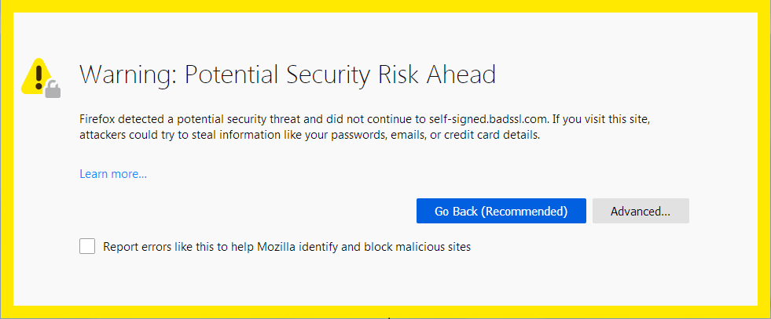
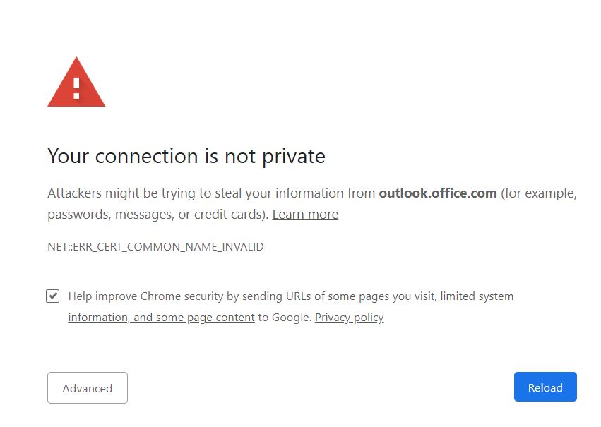

# Saveti (Web API servisi)

## Kreiranje aplikacije

Kreiranje Web API aplikacije se vrši korišćenjem `dotnet new webapi` komande. Ukoliko je verzija .NET SDK-a različita od 5.x, neophodno je koristiti komandu sa dodatkom atributa `-f`: `dotnet new webapi -f net5.0`. Na ovaj način se obezbeđuje da će se aplikacija kreirati korišćenjem verzije 5.x .NET SDK-a.

.NET Core aplikacije (od prve verzije .NET Core), projektnom posmatraju sve što se nalazi u root direktorijumu. Tako svi direktorijumi koji se nalaze u istom direktorijumu, koji je kreiran ovom komandom se posmatraju kao datoteke koje pripadaju našem projektu.

Nakon što je aplikacija kreirana, template se sastoji od dovoljno koda, da bi je bilo moguće pokrenuti. Komanda koja se koristi za pokretanje je `dotnet run` ili `dotnet watch run`. Razlika u `watch` verziji je ta što ona omogućava praćenje promena u fajlovima (osim dodavanja novih fajlova), pa je zadužena i za ponovno pokretanje aplikacije ukoliko do pronena dođe.

Ukoliko dođe do greške ovom prilikom, moguće je da je neophodno instalirati sertifikat, što se vrši sledećom komandom:

`dotnet dev-certs https`.

Ova komanda kreira lokalni sertifikat koji omogućava browser-u da pokrene aplikaciju, iako nema validni SSL sertifikat. Problem može da nastane i ovom prilikom, zato što većina browser-a danas ne podržava ovu vrstu sertifikata, pa je neophodno prilikom prvog startovanja aplikacije dozvoliti browser-u da nastavi sa korišćenjem sajta, iako je on nebezbedan.





Nakon klika na dugme `Advanced` u zavisnosti od browser-a, potrebno je još kliknuti i na `Proceed to ...` ili `Accept the Risk and Continue`, nakon čega će stranica biti otvorena.

Ukoliko je verzija .NET SDK-a koja se koristi pogrešna, to može da se zaključi iz `.csproj` datoteke. Ukoliko se koristi verzija 5.x, TargetFramework linija treba da izgleda ovako:

`<TargetFramework>net5.0</TargetFramework>`

## Podešavanja aplikacije

Datoteke koje se koriste za konfiguraciju Web API aplikacije su:

1. Program.cs
2. Startup.cs
3. appsettings.json

Ove 3 datoteke se koriste za podešavanje aplikacije. Program.cs datoteka, je kao i kod bilo kog drugog C# projekta `entry point` aplikacije. `Main` metoda koja se tamo nalazi je prva metoda koja se pokreće kada se pokrene aplikacija. Osnovni template ne sadrži nikakve modifikacije u tom fajlu, već se samo poziva konfiguraciona datoteka Startup.cs (Startup klasa) koja sadrži više informacija.

Startup klasa sadrži konstruktor, kome se putem dependency injection-a šalje instanca konfiguracionog fajla (appsettings.json, ali u obliku koji C# može da pročita). Osim konstruktora, ova klasa sadrži još dve metode, `ConfigureServices` i `Configure`. `ConfigureServices` metoda se koristi za dodavanje različitih servisa koje aplikacija može da koristi, kao što su DbContext, CorsPolicy ili mogućnost korišćenja samih kontrolera.
Kada se ovi servisi uključe u aplikaciju, da bi ih ona uspešno koristila iz kontrolera, neophodno je uključiti ih na nivou aplikacije iz metode `Configure`.

Datoteka appsettings.json se koristi za dodavanje podešavanja koja se čitaju korišćenjem Configuration property-a u Startup klasi. Primer ovakvog podešavanja je dodavanje `ConnectionString`-a.

## Kreiranje modela i korišćenje migracija

Da bi se omogućilo korišćenje model first pristupa za kreiranje baze podataka, neophodno je koristiti migracije. Za potrebu korišćenja migracija, neophodno je instalirati alat:

`dotnet tool install dotnet-ef -g`.

Update ovog alata se vrši na sledeći način:

`dotnet tool update dotnet-ef -g`.

Pošto se u realizaciji naših projekata koristi LocalDB baza podataka, neophodno je dodati i 2 reference u aplikaciju:

`dotnet add package Microsoft.EntityFrameworkCore.SqlServer`,
`dotnet add package Microsoft.EntityFrameworkCore.Design`.

Druga referenca se koristi za migracije, dok se prva koristi za komunikaciju sa SqlServer bazom podataka (u našem slučaju LocalDB).

Ukoliko se ovom prilikom javi problem, potrebno je dodati i verziju paketa koji se instalira:

`dotnet add package Microsoft.EntityFrameworkCore.SqlServer --version 5.0.12`,
`dotnet add package Microsoft.EntityFrameworkCore.Design --version 5.0.12`.

Nakon uključivanja biblioteka, moguće je koristiti alat za migraciju.

Model se kreira obično u direktorijumu `Models`, mada to ne mora da bude ograničenje. U njemu je neophodno kreirati klase za svaku tabelu u bazi koja treba da bude kreirana, kao i DbContext.

Nakon što su sve ove datoteke kreirane, podešava se ConnectionString, koji se upisuje u appsettings.json datoteku. To može da izgleda ovako:

```json
"ConnectionStrings": {
    "StudentCS": "Server=(localdb)\\StudentBaza;Database=StudentBaza"
}
```

Startup.cs fajl treba da poveže ovu bazu podataka sa kreiranim modelom i to na sledeći način:

```csharp
services.AddDbContext<FakultetContext>(p =>
    p.UseSqlServer(Configuration.GetConnectionString("StudentCS")));
```

Nakon uspešno podešenog DbContext-a, treba pozvati komandu iz komandne linije, koja se koristi za migracije:

`dotnet ef migrations add V1`.

Alat `dotnet ef` je instaliran komandom iznad, a u ovom slučaju se koristi za kreiranje nove migracije. Njen naziv je u ovom slučaju V1. Svaka sledeća migracija mora da ima različiti naziv, tako da je moguće nazivati ih redom, V1, V2, V3... ili je moguće koristiti sasvim drugačiji naziv.

Kada je migracija kreirana (u direktorijumu Migrations), potrebno je upisati ove promene u bazu podataka:

`dotnet ef database update`.

Kao što samo ime govori, ova komanda se koristi za upis izmena u bazu podataka. To može da bude i prvi poziv, pri kome se sve tabele kreiraju ili bilo koji drugi, koji će tabele samo izmeniti.

## Kreiranje kontrolera

Kreiranje kontrolera se vrši u direktorijumu Controllers. Njih može da bude više. Svaki kontroler je dekorisan atributima `[ApiController]` i `[Route(...)]` i nasleđuje `ControllerBase` klasu.

```csharp
[ApiController]
[Route("[controller]")]
public class NazivController : ControllerBase
```

Ruta `[controller]` se koristi da naziv klase kontrolera transformiše u rutu, na taj način što sa naziva klase odbaci dodatak Controller. Ruta ovog kontrolera bi bila `/Naziv`.

U kontroleru je moguće koristiti dependency injection, da bi mu se prosledila odgovarajuća verzija DbContext-a koja nam je potrebna. To se radi korišćenjem konstruktora:

```csharp
public FakultetContext Fakultet { get; set; }

public NazivController(FakultetContext context)
{
    Fakultet = context;
}
```

Na ovaj način se u property Fakultet, upisuje referenca do objekta koji predstavlja DbContext koji će se koristiti za komunikaciju sa bazom podataka. 

Kod koji se nalazi u kontroleru se sastoji od metoda, koje odgovaraju po jednom HTTP pozivu za koje će se ovaj kontroler koristiti. Ove metode mogu da budu `HttpGet` - za čitanje podataka iz kontrolera, `HttpPost` - za upis novog podatka u kontroler i u bazu, `HttpPut` - za modifikaciju i `HttpDelete` - za brisanje podataka.

Ove operacije odgovaraju CRUD operacijama. Da bi se odgovarajuća metoda označila kao bilo koja od pobrojanih, koristi se odgovarajući atribut, u kombinaciji sa rutom, koja predstavlja putanju do metode.

```csharp
[Route("PreuzmiSveIspitneRokove")]
[HttpGet]
public async Task<ActionResult> PreuzmiRokove()
{
    return Ok();
}

[Route("DodajRok/{naziv}")]
[HttpPost]
[ProducesResponseType(StatusCodes.Status201Created)]
[ProducesResponseType(StatusCodes.Status400BadRequest)]
public ActionResult DodajRok(string naziv)
{
    return Ok();
}
```

Sa prethodnog primera možemo da primetimo da metode mogu da budu sinhrone i asinhrone (korišćenjem ključne reči `async` i povratnog tipa koji je `Task` čiji je generički tip zapravo tip koji se vraća).

Takođe možemo da vidimo da je pored atributa koje smo pomenuli, moguće korišćenje i drugih. U ovom primeru `[ProducesResponseType(...)]` se koristi da označi koje povratne tipove ova metoda može da vrati.

Metode `BadRequest`, `Ok`, `StatusCode`, `NotFound` i drugi, mogu da se koriste da nam bilo koju povratnu informaciju pretvore u tip ActionResult. Ovaj povratni tip će biti pre toga serijalizovan u `JSON` podatak. Osim ActionResult tipa, naravno, moguće je koristiti i bilo koji drugi tip podataka. Svaki od njih će biti serijalizovan u JSON, ukoliko u konfiguraciji nije rečeno drugačije. To može da se uradi na sledeći način (ukoliko želimo XML rezultat):

```csharp
public void ConfigureServices(IServiceCollection services)
{
    services.AddControllers()
        .AddXmlSerializerFormatters();
}
```

Zatim u metodi kontrolera, treba dekorisati metodu sledećim atributom:

```csharp
[Produces("application/xml")]
[Route("PreuzmiPodatke")]
[HttpGet]
public object PreuzmiPodatke()
{
    return new string[] { "Podatak1", "Podatak2" };
}
```

`FromRouteAttribute`, `FromBodyAttribute`, `FromFormAttribute`, `FromQueryAttribute` i slični mogu da se koriste za preuzimanje objekata sa klijenta, na različite načine.

1. `FromRoute` je najjednostavniji način za preuzimanje vrednosti i ukoliko nije postavljen drugi atribut, svaki parametar se posmatra kao da se prenosi putem rute. U vitičastim zagradama se unosi naziv parametra unutar string-a rute, a isti naziv parametra se koristi i u metodi. Na taj način, vrednost, koja je prosleđena putem rute se kastuje u odgovarajući tip i smešta u parametar.

```csharp
[Route("Metoda/{parametar}")]
public void Metoda(int parametar)
{
    // U parametru parametar, nalaziće se vrednost koja je uneta putem rute
    // Poziv: Metoda/12
    // Vrednost: 12
}
```

2. `FromBody` se često koristi kod `HttpPost` ili `HttpPut` metoda, da bi se objekat, koji se sastoji od više prostih vrednosti preneo na serversku stranu. Za ovo se koristi body poziva.

```csharp
[Route("Metoda")]
public void Metoda([FromBody]Klasa klasa)
{
    // U parametru klasa će se naći objekat deserijalizovan iz json objekta koji je body zahteva
}
```

3. `FromForm` je sličan `FromBody` atributu. Razlika je u tome što se sada objekat prenosi prilikom kreiranja forme (input elementi na klijentskoj strani, koji se šalju sa submit ili putem JS-a).

```csharp
[Route("Metoda")]
public void Metoda([FromForm]Klasa klasa)
{
    // U parametru klasa će se naći objekat koji je kreiran na klijentskoj strani
    // kroz formu (form tag ili kroz JS FormData)
    // Kao i u prethodnom slučaju, vrši se deserijalizacija u C# objekat
}
```

4. `FromQuery` se koristi u slučaju kada želimo da putem URL-a prosledimo jednu ili više vrednosti.

```csharp
[Route("Metoda")]
public void Metoda([FromQuery]int[] niz)
{
    // Poziv bi izgledao ovako:
    // https://localhost:5001/Naziv/Metoda?niz=1&niz=2&niz=5
    // Vrednost u parametru niz za ovaj primer bio bi:
    // { 1, 2, 5 } (niz integer-a)
}
```

## Validacija

Validacija na serverskoj strani obuhvata više načina za osiguravanje aplikacije od napada, kao i od nepotrebnih ili pogrešnih zahteva. Najpre je neohodno validaciju dodati kroz atribute property-ima modela. To izgleda ovako:

```csharp
[Table("Student")]
public class Student
{
    [Key]           // Primarni ključ tabele
    public int ID { get; set; }

    [Required]
    [Range(10000, 20000)]   // Provera opsega (od 10000
                            // do 20000 su validni brojevi)
    public int Indeks { get; set; }

    [Required]
    [MaxLength(50)]
    public string Ime { get; set; }

    [Required]      // Validacija koja govori bazi
                    // da treba da kreira NOT NULL kolonu
    [MaxLength(50)] // Validacija, koja najpre
                    // u modelu proverava da li je
                    // string kraći od 50 karaktera
    public string Prezime { get; set; }
}
```

Sve atribute koji mogu da se koriste za validaciju, nalaze se na:

[Validacija](https://docs.microsoft.com/en-us/aspnet/core/mvc/models/validation)

Nakon što je model napisan i sadrži validaciju prilikom upisa u bazu podataka, potrebno je obezbediti se i u samim kontrolerima. Ova vrsta validacije je nešto drugačija.

```csharp
public ActionResult DodajIspit(int idStudenta, int idPredmeta, int idRoka, int ocena)
{
    if (idStudenta <= 0)
    {
        return BadRequest("Pogrešan iD studenta!");
    }

    if (idPredmeta <= 0)
    {
        return BadRequest("Pogrešan iD predmeta!");
    }

    if (idRoka <= 0)
    {
        return BadRequest("Pogrešan ID roka!");
    }

    if (ocena < 5 || ocena > 10)
    {
        return BadRequest("Pogrešna ocena!");
    }
    // ... Ostatak metode
}
```

Ove provere u kontroleru obezbeđuju aplikaciju od nepravilnih unosa, što može da bude problematično i za samu bazu, ukoliko validacija nije dobro izvršena, ali i za performanse servisa, zato što će postojati puno pokušaja za upis pogrešnih podataka u bazu. Bonus koji dobijamo ovakvim proverama je taj što korisniku možemo da pošaljemo smislenu poruku kako da ispravi podatke koje šalje.

## Učitavanje podataka

Učitavanje podataka iz baze podataka u model može da se vrši na više načina:

1. Lazy Loading
    - Učitavanje podataka se vrši svaki put kada se pristupa odgovarajućem property-u koji predstavlja vezu sa drugom tabelom,
2. Eager Loading
    - Podaci se učitavaju iz baze prilikom inicijalnog upita, korišćenjem `Include` i `ThenInclude` metoda,
3. Explicit Loading
    - Podaci se učitavaju kada su potrebni posebnom `Load` ili `LoadAsync` metodom. Uz njih se koriste i `Entry`, kao i `Collection` metode.


1. `Lazy Loading` može da bude koristan prilikom pisanja upita, ali njegovo korišćenje vrlo lako može da preraste u problem ukoliko se nepravilno koristi. Najprostiji način njegovog korišćenja je uključivanje biblioteke:

`Microsoft.EntityFrameworkCore.Prixies`.

Nakon što je ova biblioteka uključena, u Startup.cs fajlu je neophodno dodati sledeću liniju:

```csharp
protected override void OnConfiguring(DbContextOptionsBuilder optionsBuilder)
    => optionsBuilder
        .UseLazyLoadingProxies()        // Ova linija omogućava Lazy Loading
        .UseSqlServer(myConnectionString);

// Može da se koristi i prilikom dodavanja novog DbContext-a

.AddDbContext<BloggingContext>(
    b => b.UseLazyLoadingProxies()
          .UseSqlServer(myConnectionString));
```

Svaka veza u modelu, mora da u slučaju Lazy Loading-a bude označena kao `virtual`.

```csharp
public class Predmet
{
    [Key]
    public int ID { get; set; }

    [MaxLength(50)]
    public string Naziv { get; set; }

    [Range(1, 5)]
    public int Godina { get; set; }

    public virtual List<Spoj> PredmetStudent { get; set; }
}
```

Svaki put kada se pristupa vezi `PredmetStudent`, podaci se automatski pribavljaju. To može da bude problem naročito kod serijalizacije, pa se obično za veze koje ne treba serijalizovati, koristi `[JsonIgnore]` atribut.

Ukoliko ne želimo da koristimo ovu biblioteku i proxy-je, moguće je Lazy Loading uključiti i ručno, korišćenjem ILazyLoader interfejsa:

```csharp
public class Predmet
{
    [Key]
    public int ID { get; set; }

    [MaxLength(50)]
    public string Naziv { get; set; }

    [Range(1, 5)]
    public int Godina { get; set; }

    private ILazyLoader LazyLoader { get; set; }

    private ICollection<Spoj> spojevi;

    public Predmet(ILazyLoader lazyLoader)
    {
        LazyLoader = lazyLoader;
    }

    public ICollection<Spoj> Spojevi
    {
        get => LazyLoader.Load(this, ref spojevi);
        set => spojevi = value;
    }
}
```

Korišćenje je slično, zato što postoji property `Spojevi` koji sadrži iste podatke kao što je u prethodnom slučaju to bio property `PredmetStudent`.

Paket koji sadrži `ILazyLoader` u ovom slučaju, treba takođe uključiti:

`dotnet add package Microsoft.EntityFrameworkCore.Abstractions`

koji sadrži minimalni set tipova koji su neophodni.

Ukoliko želimo da zaobiđemo i ovaj paket, možemo da koristimo metodu `ILazyLoading.Load`. To se može uraditi na sledeći način:

```csharp
public class Predmet
{
    [Key]
    public int ID { get; set; }

    [MaxLength(50)]
    public string Naziv { get; set; }

    [Range(1, 5)]
    public int Godina { get; set; }

    private Action<object, string> LazyLoader { get; set; }

    private ICollection<Spoj> spojevi;

    public Predmet(Action<object, string> lazyLoader)
    {
        LazyLoader = lazyLoader;
    }

    public ICollection<Spoj> Spojevi
    {
        get => LazyLoader.Load(this, ref spojevi);
        set => spojevi = value;
    }
}
```

Uz dodatak male Load extension metode:

```csharp
public static class LoadingExtensions
{
    public static T Load<T>(
        this Action<object, string> loader,
        object entity,
        ref T navigationField,
        [CallerMemberName] string navigationName = null)
        where T : class
    {
        loader?.Invoke(entity, navigationName);

        return navigationField;
    }
}
```

2. `Eager loading` ostavlja veću kontrolu programeru, kada i kako će se odgovarajući podaci učitati iz baze podataka. Kada se kreira DbContext i pristupa odgovarajućem objektu, svaki povezani objekat se učitava isključivo kada se nad njim koristi `Include` ili `ThenInclude` metoda. Include se koristi na prvom nivou, kada je potrebno uključiti vezu ka objektu koji je direktno povezan sa objektnom nad kim izvršavamo operaciju, dok se ThenInclude koristi na sledećem nivou, svaki sledeći put kada se koristi, izvršava se nad objektnom koji je prethodno uključen sa Include ili ThenInclude.

```csharp
var predmeti = await StudentContext.Predmeti
    .Include(p => p.PredmetStudent)
    .ThenInclude(p => p.IspitniRok)
    .Include(p => p.PredmetStudent)
    .ThenInclude(p => p.Student)
    .ToListAsync();
```

Veza `PredmetStudent` postoji u klasi `Predmet`, a `IspitniRok` i `Student` u klasi koja predstavlja ovu vezu predmeta i studenta. Zato se `PredmetStudent` uključuje `Include` metodom, dok se svaki sledeći nivo uključuje sa `ThenInclude`. Da imamo još veza, u tim klasama (Student na primer), onda bi se ponovo koristilo na još jednom nivou `ThenInclude`.

Osim toga, moguće je koristiti i filtriranje. Ne moraju sve veze da budu uključene. Za to nam služi `Where` metoda iz LINQ-a. Takođe je moguće koristiti i druge metode, kao što je `Take` metoda, koja bi omogućila preuzimanje samo određenog broja unosa ili bilo koja druga LINQ metoda.

```csharp
var predmeti = await StudentContext.Predmeti
    .Include(p => p.PredmetStudent
        .Where(q => q.Ocena > 8))
    .ThenInclude(p => p.IspitniRok)
    .Include(p => p.PredmetStudent
        .Take(100))
    .ThenInclude(p => p.Student)
    .ToListAsync();
```

3. `Explicit Loading` nam ostavlja mogućnost, da po potrebi uključimo sve podatke koji su nam potrebni, korišćenjem `Load` (`LoadAsync`) i `Entry` ili `Collection` metode. Entry metoda se koristi za uključivanje jednog objekta (kod veze 1 -> ...), dok nam se Collection metoda koristi za uključivanje kolekcija.

```csharp
var predmet = StudentContext.Predmeti.FirstOrDefault();
await StudentContext.Entry(predmet).Collection(p => p.PredmetStudent).LoadAsync();

foreach (var p in predmet.PredmetStudent)
{
    StudentContext.Entry(p).Reference(q => q.IspitniRok).Query().Take(10).Load();
    StudentContext.Entry(p).Reference(q => q.Predmet).Load();
    StudentContext.Entry(p).Reference(q => q.Student).Load();
}
// Umesto Load može da se koristi i Query, koji omogućava dalje pisanje upita...
```

## Korisne LINQ metode

- `Where` - Ova metoda se koristi za filtriranje kolekcije podataka. Uslov se prosleđuje putem lambda expression-a.

```csharp
kolekcija.Where(p => p.Broj % 3 == 0)
```

- `Select` - Ova metoda se koristi za mapiranje kolekcije podataka.

```csharp
kolekcija.Select(p => p * 3)
```

- `Distinct` - Metoda koja nam iz kolekcije podataka vraća samo one podatke koji nisu duplikati.

- `Contains` - Proverava da li kolekcija sadrži odgovarajući element koji je prosleđen.

```csharp
kolekcija.Contains(element)
// Vraća true ukoliko sadrži, a false ukoliko ne
```

- `Min` i `Max` - Kao što im i samo ime govori, iz kolekcije vraćaju minimalni i maksimalni element.

- `Average` - Vraća prosek vrednosti iz kolekcije nad kojom se zove.

- `All` - Proverava u kolekciji, da li svi elementi zadovoljavaju uslov koji je prosleđen

```csharp
kolekcija.All(p => p % 2 == 0)
```

- `Any` - Proverava da li bar jedan element u kolekciji zadovoljava prosleđeni uslov

```csharp
kolekcija.Any(p => p % 2 == 0)
```

- `Count` - Prebrojava elemente u kolekciji.

- `First` - Vraća prvi element u kolekciji, ukoliko on postoji, a ukoliko ne, vraća grešku. Da bi se greška izbegla, moguće je koristiti `FirstOrDefault` metodu, koja vraća `null` ukoliko element nije pronađen.

- `Last` - Slično `First` metodi. Za razliku od nje, vraća poslednji element. Takođe postoji `LastOrDefault` metoda.

- `ElementAt` - Vraća element na `n`-toj poziciji, koja se prosleđuje kao parametar. Vraća grešku ukoliko on ne postoji.

- `Skip` - Preskače `n` elemenata u kolekciji.

- `Take` - Preuzima samo `n` sledećih elemenata u kolekciji.

[Sve metode](https://docs.microsoft.com/en-us/dotnet/api/system.linq.enumerable)